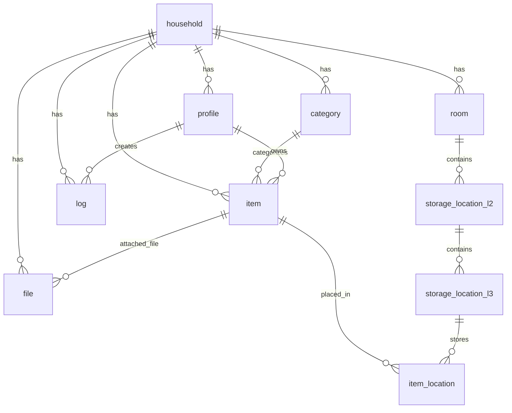

# HomeBack.app — dokument koncepcji produktu dla vibecodingu

**Wersja:** v0.2  
**Status:** dokument roboczy do implementacji MVP + zasady pracy AI  
**Typ produktu:** Progressive Web App  
**Backend:** Supabase + PostgreSQL  
**Data opracowania:** 2026-07-08  

---

## Spis treści

1. [Streszczenie wykonawcze](#1-streszczenie-wykonawcze)
2. [Opis produktu](#2-opis-produktu)
3. [Użytkownicy i potrzeby](#3-użytkownicy-i-potrzeby)
4. [Główne moduły MVP](#4-główne-moduły-mvp)
5. [Model danych](#5-model-danych)
6. [Architektura techniczna](#6-architektura-techniczna)
7. [Funkcjonalność MVP v0.1](#7-funkcjonalność-mvp-v01)
8. [Moduł Sejf — przyszłość](#8-moduł-sejf--przyszłość)
9. [Roadmap i fazy rozwoju](#9-roadmap-i-fazy-rozwoju)
10. [Integracje](#10-integracje)
11. [Bezpieczeństwo i prywatność](#11-bezpieczeństwo-i-prywatność)
12. [Plan biznesowy](#12-plan-biznesowy)
13. [Kolejne kroki i timeline](#13-kolejne-kroki-i-timeline)
14. [Pytania i decyzje do podjęcia](#14-pytania-i-decyzje-do-podjęcia)
15. [Definicje i słownik](#15-definicje-i-słownik)
16. [Zasady pracy AI / vibecoding guardrails](#16-zasady-pracy-ai--vibecoding-guardrails)
17. [Krótki prompt dla narzędzia vibecoding](#17-krótki-prompt-dla-narzędzia-vibecoding)
18. [Podsumowanie](#18-podsumowanie)

---

## 1. Streszczenie wykonawcze

### Czym jest HomeBack?

**HomeBack.app** to aplikacja webowa typu PWA do zarządzania informacją i zasobami domowymi dla całej rodziny.

Aplikacja ma być wspólną bazą wiedzy o domu: rzeczach, dokumentach, lokalizacjach, zapasach, procedurach i informacjach praktycznych.

### Problem, który rozwiązuje

- Nie wiadomo, gdzie znajdują się rzeczy w domu.
- Brakuje wspólnej bazy wiedzy dla rodziny.
- Trudno pilnować zapasów i terminów ważności.
- Dokumenty domowe są rozproszone.
- Każdy domownik szuka osobno tych samych informacji.

### Rozwiązanie

Jedno miejsce, w którym rodzina:

- kataloguje rzeczy i zna ich lokalizację,
- przechowuje oraz dzieli wiedzę o domu,
- pilnuje zapasów i terminów ważności,
- zarządza dokumentami oraz procedurami awaryjnymi,
- przygotowuje się do integracji smart home i przyszłej aplikacji mobilnej.

### Grupa docelowa

Rodziny i gospodarstwa domowe, które chcą uporządkować domową organizację, dokumenty, zapasy i informacje praktyczne.

### Model monetyzacji — przyszłość

| Plan | Założenia |
|---|---|
| Free | jedno gospodarstwo, 5 użytkowników, 50 zdjęć |
| Pro | większe limity, zaawansowane funkcje, backup |
| Premium | integracje, szablony, AI, Sejf |

### Wymogi na start

- PWA — Progressive Web App.
- Supabase jako backend.
- PostgreSQL jako relacyjna baza danych.
- Wieloużytkownikowość od pierwszego dnia.
- MVP możliwe do zbudowania w 3–4 miesiące.

---

## 2. Opis produktu

### Nazwa i identyfikacja

| Parametr | Wartość |
|---|---|
| Nazwa | HomeBack |
| URL | homeback.app |
| Typ | Progressive Web App |
| Platforma | Web, instalowalna na telefonie |
| Backend | Supabase: PostgreSQL, Auth, Storage |
| Odbiorcy | Rodziny, gospodarstwa domowe, wspólnoty mieszkaniowe |
| Język główny | Polski |
| Języki przyszłościowe | Angielski i inne |
| Tagline | Wszystko o Twoim domu w jednym miejscu |

### Zakres funkcjonalny

HomeBack służy do czterech głównych zadań:

#### 1. Inwentaryzacja rzeczy

- katalogowanie przedmiotów w domu,
- przypisanie lokalizacji: nazwa gospodarstwa (fallback: Dom/Home) → Pomieszczenie/Room → Mebel/Furniture item → Schowek/Storage space,
- zdjęcia i opisy,
- wyszukiwanie odpowiedzi na pytanie: „gdzie jest X?”.

#### 2. Organizacja domowa

- struktura pomieszczeń i miejsc przechowywania,
- kategorie rzeczy: leki, żywność, dokumenty, ubrania, elektronika,
- terminy ważności i alerty,
- zapasy minimalne.

#### 3. Współdzielenie wiedzy

- rodzinny dashboard z ważnymi informacjami,
- dokumenty i instrukcje domowe,
- karty awaryjne: bezpieczniki, woda, dokumenty,
- procedury domowe: filtr, agregat, router, piec, pralka.

#### 4. Zarządzanie dostępem

- role: administrator, domownik, dziecko, gość,
- uprawnienia do widoczności danych,
- historia zmian: kto, co i kiedy zmienił.

### Kierunek rozwoju

- integracja z Home Assistant,
- dodatek do przeglądarki,
- QR/NFC do oznaczania lokalizacji,
- eksport danych,
- aplikacja mobilna,
- Sejf na poufne dokumenty.

---

## 3. Użytkownicy i potrzeby

### Primary persona: rodzina z dziećmi

**Kim są:**

- rodzice w wieku 25–55 lat,
- dzieci w wieku 4–18 lat,
- czasem babcia, dziadek lub osoba pomagająca w domu.

### Problemy i odpowiedzi produktu

| Problem | Jak pomaga HomeBack |
|---|---|
| „Gdzie są baterie?” | Wyszukanie rzeczy i lokalizacji w kilka sekund |
| Kończą się leki | Alert o zbliżającym się terminie lub niskim stanie |
| Każdy szuka osobno | Jeden dashboard rodzinny |
| Brakuje dokumentów | Baza dokumentów, a w przyszłości Sejf |
| Dziecko nie wie, co mamy | Może wyszukiwać wybrane rzeczy |
| Przeprowadzka lub remont | Wiadomo, co było gdzie przechowywane |

### Role użytkowników

#### Administrator

- tworzy strukturę domu,
- zaprasza domowników,
- zarządza rolami i uprawnieniami,
- odpowiada za backup i bezpieczeństwo.

#### Domownik dorosły

- dodaje przedmioty,
- edytuje lokalizacje,
- przesuwa rzeczy,
- dodaje dokumenty.

#### Dziecko

- wyszukuje rzeczy z dozwolonych kategorii,
- oznacza przedmioty jako odłożone,
- nie widzi leków, dokumentów i rzeczy poufnych.

#### Gość — później

- ma ograniczony dostęp do wybranych pomieszczeń lub kategorii,
- przykładowo: sprzątaczka widzi tylko środki czystości.

---

## 4. Główne moduły MVP

MVP składa się z siedmiu modułów.

---

### Moduł 1: Rzeczy — Inventory

#### Cel

Katalogowanie przedmiotów domowych oraz ich lokalizacji.

#### Funkcje MVP

- lista przedmiotów,
- dodawanie przedmiotu przez formularz,
- zdjęcie przedmiotu,
- kategoria,
- lokalizacja 3-poziomowa,
- ilość i jednostka,
- termin ważności,
- opiekun przedmiotu,
- edycja przedmiotu,
- usunięcie do archiwum,
- wyszukiwanie tekstowe,
- filtrowanie po kategorii i pomieszczeniu.

---

### Moduł 2: Dom — Structure

#### Cel

Zarządzanie strukturą domu i miejscami przechowywania.

#### Funkcje MVP

- kreator domu na starcie,
- lista pomieszczeń,
- dodawanie pomieszczenia: nazwa i ikona,
- lista miejsc przechowywania w pomieszczeniu,
- dodawanie miejsca: nazwa i typ,
- lista pozycji szczegółowych,
- dodawanie pozycji: nazwa i opis lokalizacji,
- edycja i usuwanie,
- opcjonalne zdjęcia pomieszczeń,
- automatyczny kod lokalizacji, np. `SAL-KOM-SZ1`.

---

### Moduł 3: Rodzina — Users & Roles

#### Cel

Wieloużytkownikowość, role i zaproszenia.

#### Funkcje MVP

- lista członków gospodarstwa,
- zapraszanie członka przez e-mail,
- przypisanie roli: admin, domownik, dziecko,
- zmiana roli,
- usunięcie z gospodarstwa,
- profil użytkownika: imię, avatar,
- ostatnia aktywność w widoku administratora.

---

### Moduł 4: Dashboard — Home Screen

#### Cel

Główny ekran po zalogowaniu z szybkim dostępem do najważniejszych informacji.

#### Funkcje MVP

- powitanie użytkownika,
- 5 ostatnio dodanych przedmiotów,
- rzeczy z kończącym się terminem ważności,
- szybkie linki do pomieszczeń,
- liczba przedmiotów na kategorię,
- ostatnia aktywność domowników,
- przycisk `+ Dodaj przedmiot`.

---

### Moduł 5: Dokumenty — Knowledge Base

#### Cel

Przechowywanie instrukcji, gwarancji, procedur i domowej wiedzy.

#### Funkcje MVP

- lista dokumentów,
- dodawanie dokumentu jako zdjęcie lub PDF,
- przypisanie dokumentu do kategorii,
- opcjonalne powiązanie z konkretnym przedmiotem,
- podgląd dokumentu,
- usunięcie dokumentu.

---

### Moduł 6: Kategorie — Categories

#### Cel

Kategoryzacja przedmiotów i filtrowanie.

#### Kategorie domyślne

- Leki,
- Żywność,
- Dokumenty,
- Ubrania zimowe,
- Elektronika,
- Narzędzia,
- Książki,
- Części zapasowe.

#### Funkcje MVP

- lista kategorii systemowych i własnych,
- dodawanie własnej kategorii,
- edycja nazwy i ikony,
- opcjonalne usunięcie kategorii.

---

### Moduł 7: Ustawienia — Settings

#### Cel

Ustawienia gospodarstwa, użytkownika, eksportu i konta.

#### Funkcje MVP

- nazwa gospodarstwa,
- członkowie i role,
- eksport danych do CSV i JSON,
- ręczny snapshot bazy danych,
- zmiana języka,
- wylogowanie,
- profil konta.

---

## 5. Model danych

### Główne encje

```text
household
profile
room
storage_location_l2
storage_location_l3
category
item
item_location
file
log
vault_document — przyszłość
```

### Diagram relacji — uproszczony



---

### Encja: Household

```text
household
├── id (UUID, PK)
├── nazwa (string)
├── typ (enum: dom, mieszkanie, garaż)
├── kod_zaproszenia (unique string)
├── created_at (timestamp)
├── updated_at (timestamp)
```

### Encja: Profile

```text
profile
├── id (UUID, FK -> auth.users)
├── household_id (FK -> household)
├── imie (string)
├── email (string)
├── rola (enum: admin, domownik, dziecko, gość)
├── avatar_url (string, optional)
├── status (enum: aktywny, zaproszony, nieaktywny)
├── created_at (timestamp)
├── updated_at (timestamp)
```

### Encja: Room

```text
room
├── id (UUID, PK)
├── household_id (FK)
├── nazwa (string)
├── typ (enum: salon, sypialnia, kuchnia, garaż, piwnica, biuro)
├── ikona (string, optional)
├── opis (string, optional)
├── kolejność (int)
├── created_at (timestamp)
├── updated_at (timestamp)
```

### Encja: Storage Location L2

Widoczna nazwa poziomu L2: **Mebel** (EN: **Furniture item**). To mebel lub większy element wyposażenia, w którym przechowujesz Rzeczy.

```text
storage_location_l2
├── id (UUID, PK)
├── room_id (FK)
├── nazwa (string) — np. Komoda, Regał, Szafka
├── typ (enum: szafa, komoda, regał, półka, szuflada, pudełko, pojemnik)
├── opis (string, optional)
├── kolejność (int)
├── created_at (timestamp)
├── updated_at (timestamp)
```

### Encja: Storage Location L3

Widoczna nazwa poziomu L3: **Schowek** (EN: **Storage space**). To konkretna przestrzeń przechowywania w Meblu.

```text
storage_location_l3
├── id (UUID, PK)
├── storage_location_l2_id (FK)
├── nazwa (string) — np. 1 szuflada, 2 półka od góry
├── opis (string, optional) — np. środkowy rząd, lewa strona
├── kod_lokalizacji (string) — np. SAL-KOM-SZ1
├── identyfikator_qr (string, optional)
├── identyfikator_nfc (string, optional)
├── kolejność (int)
├── created_at (timestamp)
├── updated_at (timestamp)
```

Techniczne nazwy `room`, `storage_location_l2` i `storage_location_l3` oraz format kodów `ROOM-L2-L3` pozostają bez zmian. W interfejsie ich semantyka to odpowiednio Pomieszczenie, Mebel i Schowek (EN: Room, Furniture item, Storage space).

### Szablony struktury M4N.2

Szablony są sugestiami interfejsu, a nie zamkniętymi enumami. Użytkownik może zachować lub wpisać dowolną własną wartość.

Podstawowe Meble (L2): Komoda, Szafa, Szafka, Szafka nocna, Regał, Półka wisząca, Moduł półkowy, Łóżko, Biurko, Stół, Ława, Witryna, Kredens, RTV, Lodówka, Zamrażarka, Sejf, Walizka, Skrzynia oraz Inny mebel lub element wyposażenia.

Podstawowe Schowki (L3): Szuflada, Górna szuflada, Dolna szuflada, Górna półka, Dolna półka, Półka 1, Półka 2, Lewa półka, Prawa półka, Komora, Wnęka, Schowek pod łóżkiem, Pojemnik, Pudełko, Kosz, Organizer, Drzwiczki lewe, Drzwiczki prawe, Górna część, Dolna część oraz Inny Schowek.

Nie promujemy nieopisanego szablonu `Półka` jednocześnie na obu poziomach. Na poziomie Mebla stosujemy Półkę wiszącą, Regał lub Moduł półkowy; na poziomie Schowka stosujemy opisane warianty półki. Stara wartość `Półka` pozostaje poprawną wartością własną i nie jest automatycznie zmieniana.

Nie wykonujemy automatycznej migracji L2 do L3 ani reklasyfikacji istniejących danych. Wartości własne zachowują dokładną treść, a istniejące kody lokalizacji i format `ROOM-L2-L3` pozostają bez zmian. Nowe aliasy są używane wyłącznie podczas generowania nowych kodów.
### Bezpieczne usuwanie Mebla M4D.6

Mebel może zostać atomowo usunięty razem ze wszystkimi należącymi do niego
Schowkami. Przed usunięciem wszystkie przypisania Rzeczy w poddrzewie muszą
zostać przeniesione do jednego zewnętrznego Schowka albo odpięte. Rekordy
Rzeczy nigdy nie są usuwane razem z Meblem. Operacja obejmuje aktywne i
archiwalne Rzeczy, a cel przenoszenia musi być Schowkiem poza usuwanym Meblem
w tym samym gospodarstwie. Ponowna weryfikacja liczby Schowków, unikalnych
Rzeczy i linków przed mutacją zwraca `DEPENDENCIES_CHANGED`, gdy podsumowanie
dialogu jest nieaktualne, bez wykonania częściowej operacji.

### Bezpieczne usuwanie Pomieszczenia M4D.7

Pomieszczenie może zostać atomowo usunięte razem ze wszystkimi należącymi do
niego Meblami i Schowkami. Przed usunięciem wszystkie przypisania Rzeczy w
poddrzewie muszą zostać przeniesione do jednego Schowka w innym Pomieszczeniu
albo odpięte. Rekordy Rzeczy nigdy nie są usuwane razem ze strukturą. Operacja
obejmuje aktywne i archiwalne Rzeczy, respektuje aktywne gospodarstwo i RLS,
a ponowna weryfikacja liczby Mebli, Schowków, unikalnych Rzeczy i linków chroni
przed wykonaniem operacji na nieaktualnym podsumowaniu dialogu.

### Encja: Category

```text
category
├── id (UUID, PK)
├── household_id (FK, nullable dla kategorii systemowych)
├── key (string, nullable, unikalny stabilny identyfikator kategorii systemowej)
├── nazwa (string)
├── ikona (string, optional)
├── kolor (string, optional)
├── czy_systemowa (boolean)
├── widoczna_dla_dzieci (boolean)
├── created_at (timestamp)
├── updated_at (timestamp)
```

`category.key` jest jedynym stabilnym technicznym identyfikatorem kategorii systemowej. Kategorie własne mają `key = null`. Pole `category.system_key` nie jest używane.

### Encja: Item

```text
item
├── id (UUID, PK)
├── household_id (FK)
├── category_id (FK)
├── nazwa (string)
├── opis (text, optional)
├── typ (enum: unikalny, zapas, zestaw)
├── ilosc (decimal, optional)
├── jednostka (string, optional) — szt, kg, opakowanie
├── termin_waznosci (date, optional)
├── opiekun_id (FK -> profile, optional)
├── status (enum: w domu, zużyte, pożyczone, archiwalne)
├── przechowywany_w_sejfie (boolean)
├── miniatura_url (string, optional)
├── notatki (text, optional)
├── created_by_id (FK -> profile)
├── created_at (timestamp)
├── updated_at (timestamp)
```

### Encja: Item Location

```text
item_location
├── id (UUID, PK)
├── item_id (FK)
├── storage_location_l3_id (FK)
├── czy_glowna (boolean) — główna lokalizacja
├── notatka (string, optional)
├── created_at (timestamp)
├── updated_at (timestamp)
```

### Encja: File

```text
file
├── id (UUID, PK)
├── item_id (FK, nullable)
├── household_id (FK, nullable)
├── nazwa (string)
├── plik_url (string)
├── typ (enum: zdjecie, skan, pdf, dokument)
├── rozmiar_kb (int)
├── czy_zaszyfrowany (boolean)
├── created_by_id (FK -> profile)
├── created_at (timestamp)
```

### Encja: Log

```text
log
├── id (UUID, PK)
├── household_id (FK)
├── profil_id (FK)
├── akcja (enum: DODANO, EDYTOWANO, PRZESUNIĘTO, USUNIĘTO, ZMIENIONO_ILOŚĆ)
├── typ_obiektu (enum: ITEM, ROOM, CATEGORY, PROFILE)
├── obiekt_id (UUID)
├── zmiana_przed (json, optional)
├── zmiana_po (json, optional)
├── szczegoly (text, optional)
├── timestamp (timestamp)
```

---

## 6. Architektura techniczna

### Stack technologiczny

| Warstwa | Technologia | Uzasadnienie |
|---|---|---|
| Frontend | PWA: React, Vue lub Svelte | Responsywność, instalowalność, tryb offline |
| Backend | Supabase | PostgreSQL, Auth, Storage, Edge Functions |
| Auth | Supabase Auth | Logowanie, zaproszenia, sesje |
| Storage | Supabase Storage | Zdjęcia, skany, dokumenty |
| Szyfrowanie Sejfu | libsodium / TweetNaCl.js | Szyfrowanie po stronie klienta |
| Hosting | Vercel / Netlify | Deployment PWA |
| Domena | homeback.app | Domena `.app` |

### Rekomendowany stack dla MVP

```text
Frontend: Next.js / React
Styling: Tailwind CSS
Backend: Supabase
Database: PostgreSQL
Auth: Supabase Auth
Storage: Supabase Storage
Hosting: Vercel
Monitoring: Sentry — później
Analytics: Plausible — później
```

### Architektura logiczna

```text
┌─────────────────────────────────────┐
│ Frontend PWA                        │
│ - React / Vue / Svelte              │
│ - Responsywny UI                    │
│ - Offline-first w przyszłości       │
│ - Szyfrowanie klient-side dla Sejfu │
└──────────────┬──────────────────────┘
               │
               │ HTTPS + JWT
               │
┌──────────────▼──────────────────────┐
│ Supabase Backend                    │
│ ├── PostgreSQL                      │
│ ├── Auth                            │
│ ├── Storage                         │
│ └── Edge Functions                  │
└──────────────┬──────────────────────┘
               │
        ┌──────▼────────┐
        │ PostgreSQL    │
        │ relacyjna DB  │
        └───────────────┘
```

### Wdrożenie

- Frontend: Vercel lub Netlify.
- Backend: Supabase Hosted.
- Domena: `homeback.app`.
- DNS: Cloudflare lub Route53.
- CDN: automatycznie przez Vercel/Supabase.
- SSL: automatyczny.

### Bezpieczeństwo komunikacji

- HTTPS wszędzie.
- JWT tokens krótkotrwałe: około 1 godziny.
- Refresh tokens: około 7 dni.
- CORS ograniczony do domeny aplikacji.
- Rate limiting na wrażliwych endpointach.

---

## 7. Funkcjonalność MVP v0.1

### Zakres obowiązkowy

- [ ] Rejestracja i logowanie przez e-mail.
- [ ] Tworzenie gospodarstwa domowego.
- [ ] Kreator pomieszczeń, miejsc i pozycji.
- [ ] Dodawanie przedmiotów ręcznie i ze zdjęciem.
- [ ] Edycja przedmiotów.
- [ ] Lokalizacja 3-poziomowa.
- [ ] Wyszukiwanie tekstowe.
- [ ] Filtry: kategoria, pomieszczenie.
- [ ] Role i uprawnienia: admin, domownik, dziecko.
- [ ] Zaproszenia członków.
- [ ] Logi zmian: kto, co, kiedy.
- [ ] Dashboard podstawowy.
- [ ] Eksport CSV/JSON.
- [ ] Ręczny backup/snapshot.
- [ ] Dokumenty i instrukcje w wersji podstawowej.
- [ ] Responsywny widok mobilny.

### Poza zakresem MVP

- [ ] AI i rozpoznawanie przedmiotów ze zdjęcia.
- [ ] Home Assistant.
- [ ] QR/NFC.
- [ ] Dodatek do przeglądarki.
- [ ] Mapa mieszkania 2D.
- [ ] Alerty terminów ważności.
- [ ] Zapasy minimalne.
- [ ] Moduł Sejf.
- [ ] Multi-household.
- [ ] Native mobile app.

### User Journey: dodanie przedmiotu

```text
1. Użytkownik loguje się i trafia na Dashboard.
2. Klika „+ Dodaj przedmiot”.
3. Uzupełnia formularz:
   - zdjęcie z kamery lub galerii,
   - nazwa,
   - kategoria,
   - lokalizacja: pomieszczenie → miejsce → pozycja,
   - ilość,
   - notatka.
4. Klika „Zapisz”.
5. Wraca do listy przedmiotów.
6. System zapisuje log: „[imię] dodał [przedmiot] w [lokalizacji]”.
```

### User Journey: wyszukiwanie przedmiotu

```text
1. Użytkownik loguje się i trafia na Dashboard.
2. Klika search bar.
3. Wpisuje np. „baterie”.
4. System pokazuje wyniki.
5. Użytkownik otwiera szczegóły przedmiotu:
   - nazwa,
   - opis,
   - zdjęcie,
   - kategoria,
   - lokalizacja: Salon > Komoda > 1 szuflada,
   - opiekun,
   - historia zmian.
6. Użytkownik może edytować, przenieść lub usunąć przedmiot.
```

---

## 8. Moduł Sejf — przyszłość

### Cel

Sejf to moduł do przechowywania poufnych dokumentów i informacji, szyfrowanych end-to-end.

### Funkcje docelowe

- przechowywanie dokumentów poufnych,
- szyfrowanie danych przed wysłaniem na serwer,
- klucz szyfrowania przechowywany tylko po stronie użytkownika,
- dostęp ograniczony do wybranych osób,
- log dostępu,
- dostęp awaryjny dla administratora — opcjonalnie.

### Architektura szyfrowania

```text
┌──────────────────────────────────────┐
│ Klient — przeglądarka                │
│ ├── dokument plaintext               │
│ ├── klucz publiczny użytkownika      │
│ └── szyfrowanie libsodium            │
└────────────┬─────────────────────────┘
             │ wysyła: encrypted + metadata
             │ bez klucza prywatnego
             │
┌────────────▼─────────────────────────┐
│ Supabase / PostgreSQL                │
│ ├── encrypted_data                   │
│ ├── metadata                         │
│ └── access_log                       │
└──────────────────────────────────────┘
```

### Dekrypcja

```text
┌──────────────────────────────────────┐
│ Klient — przeglądarka                │
│ ├── encrypted_data pobrane z serwera │
│ ├── klucz prywatny z local storage   │
│ └── dekrypcja libsodium              │
│ → plaintext dokument                 │
└──────────────────────────────────────┘
```

### Encja: Vault Document

```text
vault_document
├── id (UUID, PK)
├── household_id (FK)
├── nazwa (string) — np. Paszport, Polisa ubezpieczenia
├── typ (enum: dokument, skan, notatka, dane_dostepowe)
├── encrypted_data (bytea)
├── metadata_json (json)
│   ├── file_type
│   ├── file_size
│   └── created_by
├── dostep_dla (json)
│   └── [{ profile_id, typ_dostępu: view/edit }]
├── czy_dostep_awaryjny (boolean)
├── log_dostępu (json array)
├── created_by_id (FK -> profile)
├── created_at (timestamp)
├── updated_at (timestamp)
```

### Założenia bezpieczeństwa Sejfu

Po stronie klienta:

- szyfrowanie asymetryczne,
- klucz prywatny nie opuszcza przeglądarki,
- po wylogowaniu klucz jest usuwany z pamięci.

Po stronie serwera:

- przechowywane są wyłącznie dane zaszyfrowane,
- serwer nie ma klucza do dekrypcji,
- logowany jest dostęp do dokumentów.

W MVP Sejf nie jest implementowany. Architektura powinna jednak przewidywać:

- pole `przechowywany_w_sejfie` w tabeli `item`,
- przyszłą tabelę `vault_document`,
- przyszłe funkcje szyfrowania po stronie klienta.

---

## 9. Roadmap i fazy rozwoju

### Faza 1: Fundament MVP — miesiące 1–4

Cel: działająca aplikacja do inwentaryzacji rzeczy.

Zakres:

- rejestracja i logowanie,
- gospodarstwo domowe,
- 3-poziomowa struktura domu,
- dodawanie przedmiotów,
- wyszukiwanie,
- role i uprawnienia,
- logi,
- eksport,
- responsywne MVP.

Timeline:

| Okres | Prace |
|---|---|
| Tygodnie 1–2 | Setup Supabase, struktura bazy |
| Tygodnie 3–4 | Logowanie i rejestracja |
| Tygodnie 5–6 | Moduł Rzeczy — CRUD |
| Tygodnie 7–8 | Moduł Dom |
| Tygodnie 9–10 | Role i uprawnienia |
| Tygodnie 11–12 | Dashboard i wyszukiwanie |
| Tygodnie 13–14 | Testowanie i poprawki |
| Tygodnie 15–16 | Publikacja MVP — internal launch |

### Faza 2: Użyteczność domowa — miesiące 5–6

- terminy ważności i alerty,
- zapasy minimalne,
- lista zakupów,
- rzeczy sezonowe,
- pożyczone przedmioty,
- przypomnienia,
- katalog instrukcji i gwarancji.

### Faza 3: Centrum domowe — miesiące 7–8

- rozszerzony dashboard rodzinny,
- własne linki i skróty,
- karty awaryjne,
- domowa wiki,
- procedury awaryjne.

### Faza 4: Integracje i automatyzacje — miesiące 9–10

- dodatek do przeglądarki,
- skan kodów kreskowych,
- druk etykiet QR,
- backup do Google Drive / Dropbox,
- webhooks.

### Faza 5: AI i przestrzeń — miesiące 11–12

- rozpoznawanie przedmiotów ze zdjęcia,
- sugestie kategorii,
- naturalna wyszukiwarka po polsku,
- mapa mieszkania 2D,
- zdjęcia lokalizacji z oznaczeniami.

### Faza 6: Smart Home — miesiące 13–18

- integracja z Home Assistant,
- informacje techniczne: temperatura, alarmy,
- skróty do widoków Home Assistant,
- powiadomienia techniczne,
- urządzenia domowe jako zasoby w HomeBack.

### Faza 7: Sejf i produkt publiczny — miesiące 19–24

- Sejf z szyfrowaniem end-to-end,
- rozszerzona rola Gościa,
- multi-household,
- subskrypcje Free/Pro/Premium,
- szablony gospodarstw,
- aplikacja mobilna,
- 2FA/SSO,
- marketplace szablonów.

---

## 10. Integracje

### Obecne / MVP

- Google Sign-in — opcjonalnie.
- Eksport CSV/JSON.

### Planowane

#### Faza 4

- dodatek do przeglądarki: Chrome, Firefox, Safari,
- Google Drive / Dropbox dla backupu,
- API webhook.

#### Faza 5

- API publiczne dla developerów,
- integracja z aplikacjami list zakupów.

#### Faza 6

- Home Assistant,
- Google Home,
- Apple Home / HomeKit,
- Amazon Alexa,
- SmartThings,
- kamery / NVR,
- sensory: temperatura, wilgotność, ruch.

#### Faza 7

- IFTTT / Zapier,
- integracje z bankami,
- integracje z e-commerce i trackingiem zamówień.

---

## 11. Bezpieczeństwo i prywatność

### Zasady bezpieczeństwa

| Aspekt | Podejście |
|---|---|
| Dane | Supabase, najlepiej region EU |
| Transport | HTTPS, TLS 1.3+ |
| Autentykacja | E-mail + hasło, opcjonalnie Google SSO |
| Sesje | JWT około 1h, refresh token około 7 dni |
| Uprawnienia | Row-Level Security w Supabase |
| Pliki | Supabase Storage, prywatny bucket per household |
| Szyfrowanie | End-to-end dla Sejfu w Fazie 7 |
| Backup | Snapshot Supabase + ręczny eksport |
| Audit | Log wszystkich zmian |

### Prywatność

- zgodność z RODO,
- brak sprzedaży danych,
- anonimowa analityka — opcjonalnie Plausible,
- polityka prywatności przed publikacją,
- eksport wszystkich danych w formacie otwartym,
- możliwość usunięcia konta i danych.

### Przykładowe polityki RLS

```sql
-- Użytkownik widzi tylko dane swojego gospodarstwa.
CREATE POLICY household_policy ON item
  FOR SELECT
  USING (
    household_id IN (
      SELECT household_id FROM profile 
      WHERE id = auth.uid()
    )
  );

-- Dziecko widzi tylko kategorie dostępne dla dzieci.
CREATE POLICY child_access ON item
  FOR SELECT
  USING (
    auth.jwt() ->> 'role' != 'child'
    OR category_id IN (
      SELECT id FROM category 
      WHERE widoczna_dla_dzieci = true
    )
  );
```

### Plan migracji danych

Jeśli backend zostanie zmieniony:

1. Pełny eksport z Supabase do JSON.
2. Transformacja do nowego formatu.
3. Import do nowej bazy.
4. Walidacja danych.
5. Migracja użytkowników lub nowe konta/SSO.

---

## 12. Plan biznesowy

### Model monetyzacji — przyszłość

| Plan | Cena | Zakres |
|---|---:|---|
| Free | 0 | jedno gospodarstwo, 5 użytkowników, 50 zdjęć, MVP |
| Pro | 9.99 USD / miesiąc | jedno gospodarstwo, nielimitowani użytkownicy, 1 GB storage, Home Assistant, support |
| Premium | 19.99 USD / miesiąc | 5 gospodarstw, większy storage, Sejf, integracje, priority support, szablony |

### Koszty miesięczne — szacunek

| Pozycja | Koszt / miesiąc | Notatka |
|---|---:|---|
| Supabase Pro | 25 USD | baza, storage, edge functions |
| Vercel Pro | 20 USD | hosting PWA |
| Domena `.app` | 12 USD | homeback.app |
| Sendgrid | 20 USD | zaproszenia i notyfikacje |
| Sentry | 29 USD | error tracking |
| Razem | ok. 106 USD | przy 100+ aktywnych użytkownikach |

### Przychody — scenariusz orientacyjny

| Źródło | Założenie | Przychód |
|---|---:|---:|
| Free | 1000 użytkowników | 0 USD |
| Pro | 100 użytkowników | ok. 1000 USD / miesiąc |
| Premium | 20 użytkowników | ok. 400 USD / miesiąc |
| Razem |  | ok. 1400 USD / miesiąc |

Realnie pierwsze 6–12 miesięcy to okres testowania, kosztów i niskich przychodów.

---

## 13. Kolejne kroki i timeline

### Przed startem vibecodingu

- [x] Dokument koncepcji.
- [x] Model danych.
- [x] Architektura frontend/backend.
- [x] Roadmapa faz.

### Faza przygotowania — tydzień 1–2

#### Tydzień 1

- [ ] Setup Supabase: baza, auth, storage.
- [ ] Konfiguracja struktury bazy.
- [ ] Skrypty `CREATE TABLE`.
- [ ] Setup Vercel / Netlify.
- [ ] Repozytorium Git.

#### Tydzień 2

- [ ] Wireframe'y MVP.
- [ ] Component library / design system.
- [ ] Mockupy 5–7 głównych ekranów.

### Implementacja — tygodnie 3–16

| Okres | Zakres |
|---|---|
| Tygodnie 3–4 | Auth, rejestracja, logowanie, gospodarstwo, e-mail verification |
| Tygodnie 5–6 | Struktura domu: pomieszczenia, miejsca, pozycje |
| Tygodnie 7–8 | Przedmioty: formularz, zdjęcia, kompresja, upload |
| Tygodnie 9–10 | Wyszukiwanie, filtry, sortowanie, paginacja |
| Tygodnie 11–12 | Role, RLS, dashboard, zaproszenia |
| Tygodnie 13–14 | Audit log, eksport, backup, testy |
| Tygodnie 15–16 | UI/UX, mobile, performance, security audit, internal launch |

### Feedback i iteracja — tydzień 17–20

- [ ] Testy na rzeczywistych użytkownikach.
- [ ] Zbieranie feedbacku.
- [ ] Bug fixes.
- [ ] Uzupełnienia MVP.
- [ ] Publikacja v0.2 jako public beta.

### Metryki sukcesu MVP

- aplikacja działa bez crashów,
- dodanie przedmiotu trwa poniżej 30 sekund,
- wyszukiwanie działa dla 95% typowych zapytań,
- mobile odpowiada za większość scenariuszy użycia,
- uptime 99%,
- load time poniżej 2 sekund,
- feedback użytkowników powyżej 4/5.

---

## 14. Pytania i decyzje do podjęcia

| Decyzja | Opcje | Rekomendacja |
|---|---|---|
| Język | PL / PL+EN | PL na start, EN przed wydaniem publicznym |
| Frontend | React / Vue / Svelte | React |
| Auth społeczny | tylko e-mail / Google od MVP | e-mail na start, Google w Fazie 2 |
| Hosting | Vercel / Netlify / inny | Vercel |
| Czas MVP | 3 miesiące / 4 miesiące | 4 miesiące |

---

## 15. Definicje i słownik

| Termin | Definicja |
|---|---|
| Gospodarstwo domowe | Główny pojemnik danych: dom, mieszkanie, garaż lub biuro |
| Pomieszczenie | Poziom 1 lokalizacji: salon, kuchnia, garaż |
| Mebel | Poziom 2 lokalizacji: komoda, regał, szafka; większy element wyposażenia, w którym przechowujesz Rzeczy |
| Schowek | Poziom 3 lokalizacji: szuflada, górna półka, pudełko; konkretna przestrzeń w Meblu |
| Przedmiot | Konkretna rzecz: bateria AA, paszport, kurtka zimowa |
| Kategoria | Typ rzeczy: leki, żywność, dokumenty |
| Rola | Poziom dostępu: admin, domownik, dziecko, gość |
| Log | Historia zmian: kto, co i kiedy zrobił |
| Sejf | Moduł zaszyfrowanych dokumentów poufnych |
| PWA | Progressive Web App, aplikacja web instalowalna na telefon |
| RLS | Row-Level Security, uprawnienia na poziomie wierszy bazy danych |

---


## 16. Zasady pracy AI / vibecoding guardrails

Ten rozdział jest kontraktem wykonawczym dla pracy z narzędziami AI podczas implementacji aplikacji HomeBack. Ma ograniczać halucynacje, samowolne rozszerzanie zakresu i zmiany architektoniczne wykonywane bez decyzji właściciela projektu.

### 16.1. Źródło prawdy

Źródłem prawdy dla implementacji jest ten dokument.

Jeżeli prompt użytkownika, kod, sugestia AI albo wcześniejsza decyzja są sprzeczne z dokumentem, AI ma obowiązek:

1. zatrzymać implementację danej zmiany,
2. wskazać sprzeczność,
3. oznaczyć temat jako `[WYMAGA DECYZJI]`,
4. zaproponować najprostsze rozwiązanie zgodne z MVP,
5. poczekać na zgodę właściciela projektu.

AI nie może samodzielnie rozstrzygać konfliktów zakresu produktu.

### 16.2. Zamrożony zakres MVP

Zakres MVP obejmuje wyłącznie funkcje opisane w sekcji **7. Funkcjonalność MVP v0.1**.

Dozwolone moduły MVP:

1. Rzeczy / Inventory,
2. Dom / Structure,
3. Rodzina / Users & Roles,
4. Dashboard,
5. Dokumenty / Knowledge Base,
6. Kategorie,
7. Ustawienia.

AI nie może samodzielnie dodawać funkcji spoza MVP, nawet jeśli uzna je za logiczne, użyteczne, typowe lub poprawiające UX.

### 16.3. Bezwzględny zakaz tworzenia nowych modułów bez zgody

AI ma bezwzględny zakaz tworzenia nowych modułów aplikacji bez wyraźnego pozwolenia właściciela projektu.

Za nowy moduł uznaje się każdą wydzieloną część aplikacji, która:

- ma własny ekran lub sekcję nawigacji,
- wymaga nowych tabel w bazie danych,
- dodaje osobny obszar funkcjonalny,
- rozszerza produkt poza moduły opisane w MVP,
- wymaga osobnych uprawnień, routingu lub osobnej logiki biznesowej.

### 16.4. Funkcje zakazane w MVP bez osobnej decyzji

W MVP nie wolno dodawać bez osobnej zgody:

- AI / rozpoznawania przedmiotów ze zdjęcia,
- integracji z Home Assistant,
- QR/NFC,
- dodatku do przeglądarki,
- mapy mieszkania 2D,
- natywnej aplikacji mobilnej,
- modułu Sejf,
- płatności i subskrypcji,
- multi-household,
- marketplace,
- rozbudowanych powiadomień,
- automatycznych sugestii kategorii,
- integracji zewnętrznych spoza MVP.

### 16.5. Zasada: najpierw plan, potem kod

Przed większą zmianą AI musi przygotować plan implementacji.

Plan musi zawierać:

- cel zmiany,
- zakres zmiany,
- listę plików do utworzenia lub edycji,
- informację, czy zmiana mieści się w MVP,
- wpływ na bazę danych,
- wpływ na uprawnienia i RLS,
- możliwe skutki uboczne,
- sposób testowania.

AI może przejść do implementacji dopiero po akceptacji planu.

### 16.6. Poziomy zgody

#### Można wykonać bez dodatkowego potwierdzenia

- poprawka literówki,
- drobna korekta stylów,
- poprawka oczywistego błędu składniowego,
- refaktor bez zmiany działania,
- dodanie walidacji opisanej w dokumencie,
- poprawka błędu zgodna z istniejącą architekturą.

#### Wymaga potwierdzenia

- utworzenie nowego większego komponentu,
- dodanie nowej trasy aplikacji,
- dodanie nowej tabeli,
- zmiana istniejącej tabeli,
- dodanie nowej biblioteki,
- zmiana konfiguracji Supabase,
- zmiana polityk RLS,
- zmiana routingu,
- zmiana struktury folderów,
- zmiana sposobu autentykacji,
- zmiana modelu ról i uprawnień.

#### Zakazane bez osobnej decyzji produktowej

- dodanie nowego modułu,
- rozszerzenie MVP,
- dodanie płatności,
- dodanie AI,
- dodanie Home Assistant,
- dodanie Sejfu,
- zmiana stacku technologicznego,
- zmiana frameworka frontendowego,
- zmiana backendu,
- usunięcie istniejących założeń z dokumentu.

### 16.7. Zakaz halucynowania funkcji i założeń

AI nie może zakładać, że aplikacja ma funkcje, których nie opisano w dokumencie.

Jeżeli brakuje informacji, AI powinno oznaczyć brak jako:

```text
[WYMAGA DECYZJI]
```

Przykład:

```text
[WYMAGA DECYZJI] Nie określono, czy dziecko może dodawać nowe przedmioty, czy tylko je wyszukiwać.
```

AI nie może wypełniać takich luk własnym założeniem i implementować go jako fakt.

### 16.8. Reguły modelu danych

AI nie może bez zgody:

- zmieniać nazw tabel,
- zmieniać nazw pól,
- usuwać pól,
- zmieniać typów danych,
- dodawać relacji,
- usuwać relacji,
- zmieniać kardynalności relacji,
- dodawać enumów spoza dokumentu,
- tworzyć alternatywnej struktury danych.

Każda migracja bazy danych musi zawierać:

- opis celu,
- SQL migracji,
- wpływ na istniejące dane,
- sposób cofnięcia zmiany,
- wpływ na RLS,
- sposób testowania.

### 16.9. Reguły bezpieczeństwa

Aplikacja przechowuje dane domowe, rodzinne, lokalizacyjne i dokumenty, dlatego bezpieczeństwo ma pierwszeństwo przed szybkością implementacji.

AI nie może:

- wyłączać RLS w Supabase,
- tworzyć publicznych bucketów dla danych użytkowników,
- zapisywać sekretów w kodzie,
- logować danych wrażliwych,
- omijać autoryzacji „tymczasowo”,
- tworzyć funkcji dostępnych bez sprawdzenia gospodarstwa domowego,
- zakładać, że dane jednego gospodarstwa mogą być widoczne dla innego.

Każda funkcja odczytu i zapisu danych musi respektować `household_id`.

### 16.10. Reguły storage i plików

Pliki użytkowników muszą być prywatne.

AI nie może:

- tworzyć publicznego dostępu do zdjęć, skanów i dokumentów,
- mieszać plików różnych gospodarstw,
- zapisywać plików bez powiązania z `household_id`,
- generować trwałych publicznych linków bez zgody,
- przechowywać poufnych dokumentów poza mechanizmem przewidzianym w architekturze.

Dla MVP pliki mogą obejmować zdjęcia przedmiotów oraz podstawowe dokumenty/instrukcje. Moduł Sejf nie jest częścią MVP.

### 16.11. Reguły zależności i bibliotek

AI nie może dodawać nowych bibliotek bez zgody.

Każda propozycja dodania zależności musi zawierać:

- nazwę biblioteki,
- powód dodania,
- alternatywę bez biblioteki,
- wpływ na bundle size,
- ryzyka bezpieczeństwa,
- licencję,
- informację, czy biblioteka jest konieczna dla MVP.

### 16.12. Raport po wykonaniu zadania

Po każdej zmianie AI musi przygotować raport:

```md
## Raport zmiany

### Zmieniono
- ...

### Pliki
- ...

### Zgodność z MVP
Tak / Nie / Wymaga decyzji

### Baza danych
Brak zmian / Zmieniono: ...

### Bezpieczeństwo
Brak zmian / Wpływ: ...

### Test
1. ...
2. ...

### Wymaga decyzji
- ...
```

### 16.13. Rejestr decyzji produktowych

Każda decyzja rozszerzająca zakres produktu musi zostać dopisana do rejestru decyzji.

| Data | Decyzja | Powód | Wpływ na MVP | Status | Zatwierdził |
|---|---|---|---|---|---|
|  |  |  |  |  |  |

Bez wpisu w rejestrze decyzji AI nie może traktować nowego założenia jako obowiązującego.

### 16.14. Komendy kontrolne dla pracy z AI

Właściciel projektu może używać następujących komend:

| Komenda | Znaczenie |
|---|---|
| `PLAN` | Przygotuj plan, nie pisz kodu. |
| `IMPLEMENTUJ` | Wykonaj zaakceptowany plan. |
| `STOP` | Przerwij implementację. |
| `TYLKO ANALIZA` | Nie zmieniaj plików. |
| `BEZ NOWYCH MODUŁÓW` | Nie rozszerzaj zakresu funkcjonalnego. |
| `SPRAWDŹ Z MVP` | Porównaj propozycję z zakresem MVP. |
| `WYMAGA DECYZJI` | Oznacz wszystkie niejasności przed kodowaniem. |

### 16.15. Domyślna zasada działania

Jeżeli AI nie ma pewności, czy dana zmiana jest dozwolona, ma przyjąć, że nie jest dozwolona.

Domyślne zachowanie:

1. nie implementuj,
2. opisz wątpliwość,
3. oznacz temat jako `[WYMAGA DECYZJI]`,
4. zaproponuj najprostsze rozwiązanie zgodne z MVP,
5. poczekaj na zgodę właściciela projektu.

---

## 17. Krótki prompt dla narzędzia vibecoding

Ten prompt należy wkleić na początku sesji pracy w narzędziu vibecoding albo zapisać jako plik instrukcji projektowych.

```text
Pracujesz nad aplikacją HomeBack.app zgodnie z dokumentem produktu w repozytorium. Traktuj dokument jako jedyne źródło prawdy.

Zasady obowiązkowe:
1. Nie twórz nowych modułów bez wyraźnej zgody właściciela projektu.
2. Nie rozszerzaj MVP poza opisane moduły: Rzeczy, Dom, Rodzina, Dashboard, Dokumenty, Kategorie, Ustawienia.
3. Nie dodawaj AI, Home Assistant, QR/NFC, Sejfu, płatności, multi-household, mapy 2D ani aplikacji mobilnej native w MVP.
4. Nie zmieniaj modelu danych, nazw tabel, pól, relacji, RLS, routingu, stacku ani zależności bez potwierdzenia.
5. Przed większą zmianą przygotuj plan: cel, zakres, pliki, wpływ na bazę, wpływ na RLS, ryzyka, testy.
6. Jeżeli czegoś nie ma w dokumencie, oznacz to jako [WYMAGA DECYZJI] i nie implementuj na podstawie domysłu.
7. Każda funkcja odczytu i zapisu danych musi respektować household_id oraz RLS.
8. Nie wyłączaj zabezpieczeń „tymczasowo”. Nie twórz publicznych bucketów dla danych użytkowników. Nie zapisuj sekretów w kodzie.
9. Po każdej zmianie przygotuj raport: co zmieniono, pliki, zgodność z MVP, baza danych, bezpieczeństwo, testy, kwestie wymagające decyzji.

Domyślna zasada: gdy nie masz pewności, zatrzymaj się, wskaż problem i poproś o decyzję zamiast zgadywać.
```

### 17.1. Rekomendowane miejsce plików w repozytorium

Najbezpieczniejsza struktura:

```text
homebase/
├── README.md
├── docs/
│   ├── product/
│   │   └── homebase-product-spec.md
│   ├── ai/
│   │   └── vibecoding-guardrails.md
│   └── decisions/
│       └── decision-log.md
├── src/
├── supabase/
│   ├── migrations/
│   └── policies/
└── tests/
```

Rekomendacja:

- pełny dokument produktu: `docs/product/homebase-product-spec.md`,
- krótkie zasady dla AI: `docs/ai/vibecoding-guardrails.md`,
- rejestr decyzji: `docs/decisions/decision-log.md`,
- link do dokumentów: w głównym `README.md`.

Jeżeli używane narzędzie AI obsługuje własny plik instrukcji projektowych, warto dodatkowo skopiować krótki prompt do pliku obsługiwanego przez dane narzędzie. Dokument w `docs/` pozostaje jednak głównym źródłem prawdy.

---

## 18. Podsumowanie

HomeBack to aplikacja, która:

- rozwiązuje problem „gdzie to jest w domu?”,
- tworzy wspólną bazę wiedzy dla rodziny,
- pilnuje zapasów, dokumentów i lokalizacji,
- od początku zakłada wieloużytkownikowość,
- jest projektowana jako produkt publiczny,
- ma czytelny plan MVP i rozwoju,
- przewiduje integrację z Home Assistant,
- w późniejszej fazie otrzyma Sejf na poufne dokumenty.

### Następne kroki

1. Zatwierdzenie zakresu MVP.
2. Setup Supabase.
3. Przygotowanie skryptów bazy danych.
4. Wireframe'y MVP.
5. Rozpoczęcie vibecodingu.
6. Testy rodzinne.
7. Iteracja i publikacja v0.1.

---

## Historia zmian

| Wersja | Data | Zmiany |
|---|---|---|
| 0.2 | 2026-07-08 | Dodano guardrails dla AI, krótki prompt vibecodingowy i rekomendowaną strukturę plików |
| 0.1 | 2026-07-08 | Dokument koncepcji produktu przygotowany do vibecodingu |
